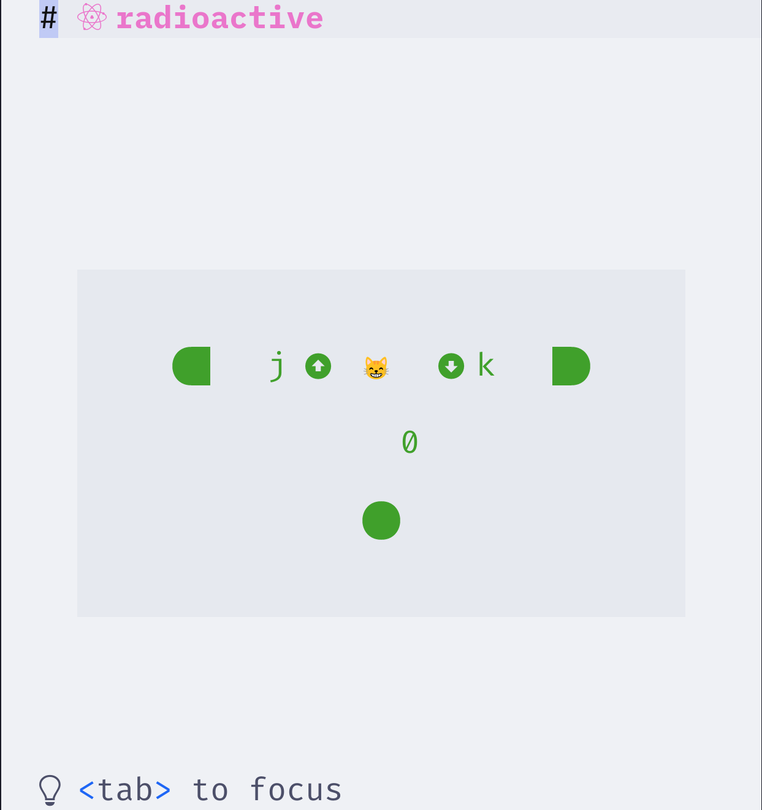
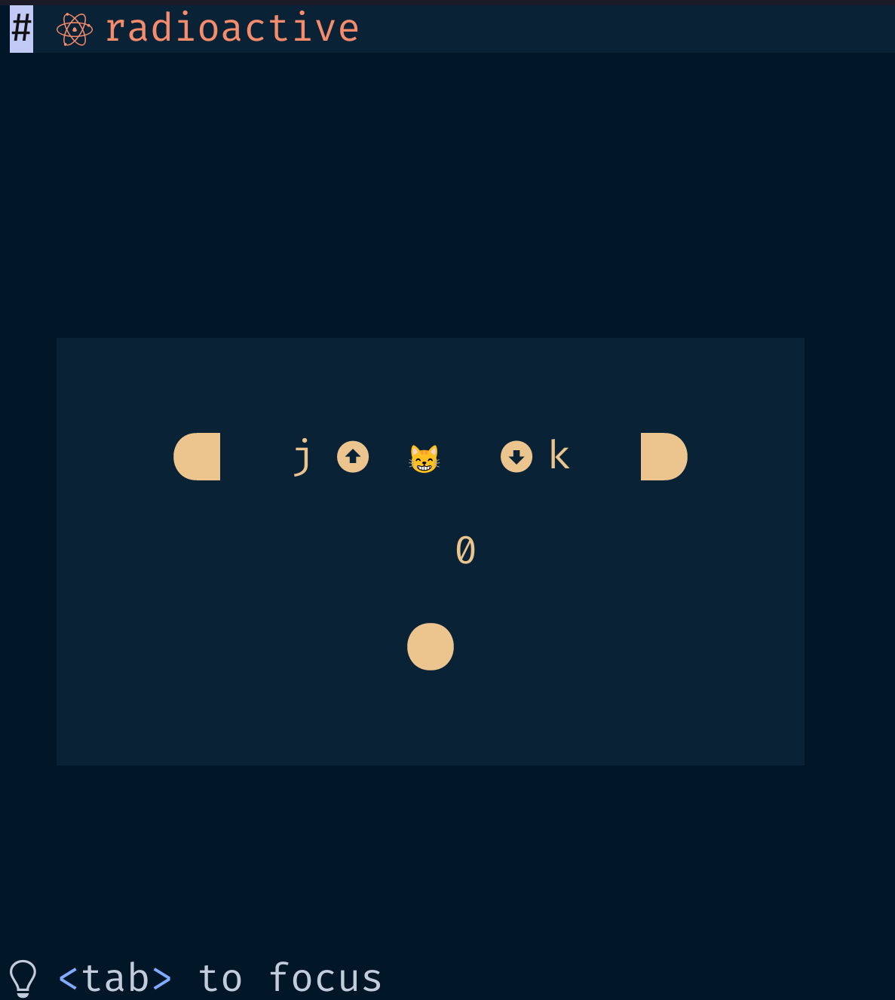
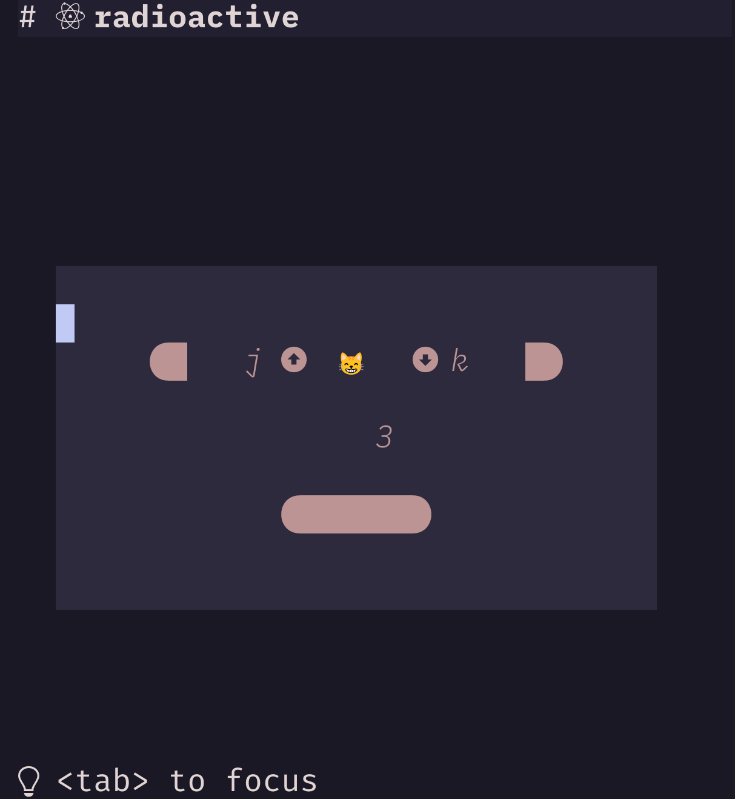
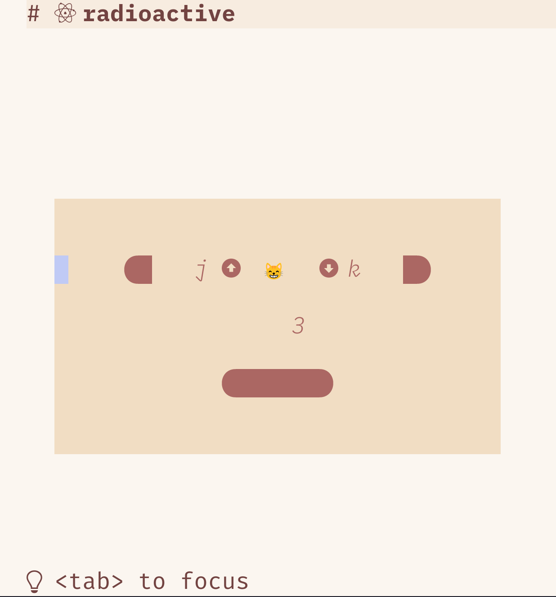
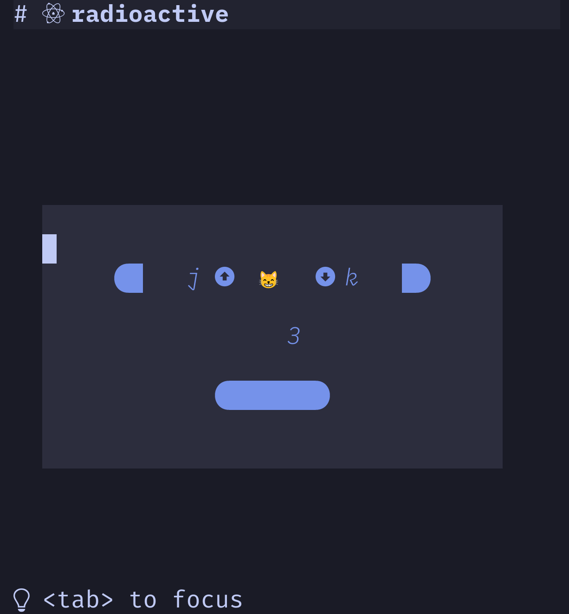
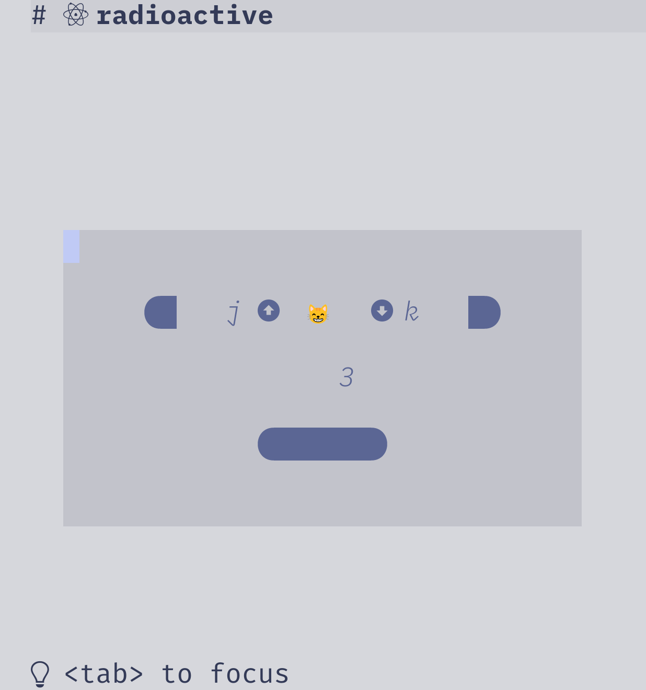
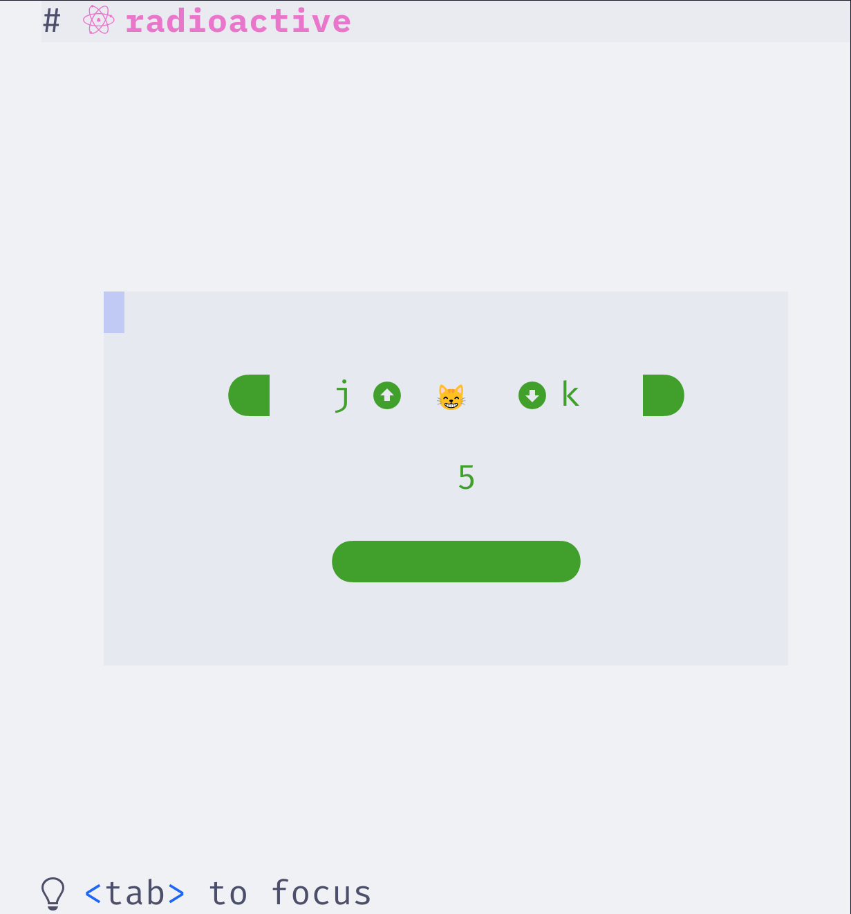

# radioactive

Reactive components using neovim and treesitter.

The goal is to emulate **browser + html + javascript**
with **neovim + html? + lua** for terminal apps.

Best part? too many amazing free themes:

<div style="display: flex; height: 1024; flex-wrap: wrap;">
  
  
  
  
  
  
  
<div>

## Installation

```bash
# Decide place to put this
APPNAME=nvim-apps/radioactive

# Clone the repo
git clone https://github.com/manyids2/radioactive "$XDG_CONFIG_HOME/$APPNAME"

# Check the demo
cd "$XDG_CONFIG_HOME/$APPNAME"
export NVIM_APPNAME="$APPNAME"
nvim
```

## Demo

- counter -> Frame, Label, Button



- taskwarrior -> Frame, Buttons, Tabs, Inputs, Filters, Search

## Initial roadmap

- `self`
  - reference to module itself
- `DOM`
  - alternate buffer with treesitter repr of GUI
- `renderer`
  - need custom renderer to manage grids, z-index, visible, etc.
- `config`
  - recorded
- `state`
  - `name`
  - `rect`
  - `dirty`
  - `visible`
- `init`
  - needs `config`
  - calls `render`
- `events`
  - autocommands on `DOM`, and filter using treesitter
- `render`
  - based on `dirty` flag in `state`
  - needs `renderer` that remembers `rect`
- `destroy`

## Components

- create `DOM` using treesitter
- can find parent, siblings, children
- record references to states
- root component
  - child A
  - child B

on each `update`, check dirty flag of full tree.

## Rev 1.0

Core Logic and constraints

- `init.lua`

- `ui.lua`

- `layout.lua`

- `keys.lua`

- `au.lua`

Widget specification

- `button.lua`

App specification

- `counter.lua`
