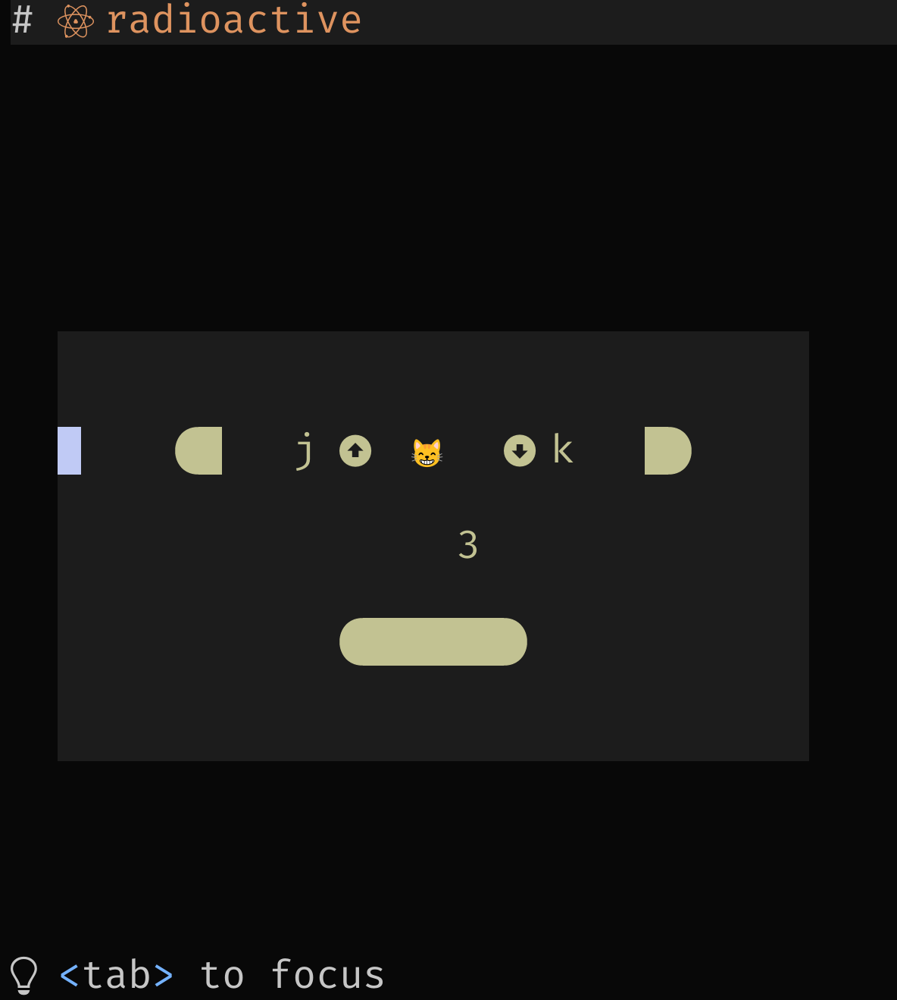

# radioactive

Reactive components using neovim and treesitter.

The goal is to emulate **browser + html + javascript**
with **neovim + html? + lua** for terminal apps.

The current repo is a proof of concept to create
a reactive framework that works with composable
and reusable components.

Some kind of plan here: [docs](https://github.com/manyids2/radioactive/blob/main/doc/radioactive.txt)

The motivation is:
  - Neovim is cross-platform
  - consistent 'native ui'
  - already looks good out of the box
  - easy access to features, themes through plugins
  - now supports `NVIM_APPNAME`, allowing for standalone apps
  - startup is blazing fast 🔥
  - easy way to share custom widgets, simply using `lazy.nvim`
  - app elements like div, navbar, tabs, toasts, etc. already available
  - package management is automatic with `lazy.nvim`
  - already has searchable DOM using treesitter
    - so technically, possible to render HTML to a 'Neovim GUI'

The main challenges are:
  - Support for  `lua` ( e.g. libs for json, yaml, sql, etc. )
  - Implementation of DOM using treesitter maybe in shadow buffer
  - Layout engine, supporting resize
  - State management
  - Style using highlights

Best part? too many amazing free themes:

<div style="display: flex; height: 1024px; flex-direction: row; flex-wrap: wrap;">
  
  
  
  
  
  
  
  
<div>

## Installation

```bash
# Decide place to put this
APPNAME=nvim-apps/radioactive

# Clone the repo
git clone https://github.com/manyids2/radioactive "$XDG_CONFIG_HOME/$APPNAME"

# Check the demo
cd "$XDG_CONFIG_HOME/$APPNAME"
export NVIM_APPNAME="$APPNAME"
nvim
```

## Usage

Edit `init.lua` already available at "$XDG_CONFIG_HOME/$APPNAME/init.lua"

```lua
-- bootstrap lazy.nvim
require("radioactive.bootstrap")

-- start app
local ui = require("radioactive.ui")
ui.setup({ app = "examples.counter" })
ui.init()
```

Start the app from `bash`:
```bash
export NVIM_APPNAME=radioactive
nvim
```

Start the app from `fish`:
```bash
set -x NVIM_APPNAME=radioactive
nvim
```

## Demo

- counter -> Frame, Label, Button


```lua
local button = require("radioactive.widgets.button")

local buttons_id = "buttons"
local buttons = button.setup({
  id = buttons_id,
  data = { count = 0 },
  rect = { col = 0.1, row = 0.3, width = 0.8, height = 0.4, zindex = 500 },
  style = { align_vertical = "center", align_horizontal = "center" },
  format_lines = function(self)
    self.state.text = {
      "█   j   😸   k   █",
      "",
      string.format("%3s", self.data.count),
      "",
      "" .. string.rep("██", math.abs(math.ceil(self.data.count))) .. "",
    }
  end,
  keys = {
    increment = {
      "n",
      "j",
      function(components)
        local c = components.buttons
        c.data.count = math.min(10, c.data.count + 1)
      end,
      { buttons_id },
    },
    decrement = {
      "n",
      "k",
      function(components)
        local c = components.buttons
        c.data.count = math.max(-10, c.data.count - 1)
      end,
      { buttons_id },
    },
  },
})

return {
  id = "counter",
  class = "counter",
  children = { buttons },
  state = { count = 0 },
}
```

- taskwarrior -> Frame, Buttons, Tabs, Inputs, Filters, Search

## Initial roadmap

- `self`
  - reference to module itself
- `DOM`
  - alternate buffer with treesitter repr of GUI
- `renderer`
  - need custom renderer to manage grids, z-index, visible, etc.
- `config`
  - recorded
- `state`
  - `name`
  - `rect`
  - `dirty`
  - `visible`
- `init`
  - needs `config`
  - calls `render`
- `events`
  - autocommands on `DOM`, and filter using treesitter
- `render`
  - based on `dirty` flag in `state`
  - needs `renderer` that remembers `rect`
- `destroy`

## Components

- create `DOM` using treesitter
- can find parent, siblings, children
- record references to states
- root component
  - child A
  - child B

on each `update`, check dirty flag of full tree.

## Rev 1.0

Core Logic and constraints

- `init.lua`

- `ui.lua`

- `layout.lua`

- `keys.lua`

- `au.lua`

Widget specification

- `button.lua`

App specification

- `counter.lua`
